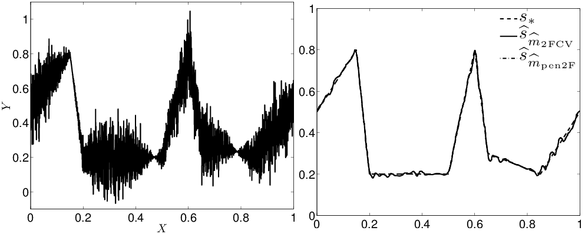

## V-fold model selection for localized bases

This is the code to reproduce all the experiments presented in the paper

**F. Navarro and A. Saumard
 
[Efficiency of the V-fold model selection for localized bases](https://link.springer.com/chapter/10.1007/978-3-319-96941-1_4), 
In: Bertail P., Blanke D., Cornillon PA., Matzner-Løber E. (eds) Nonparametric Statistics. ISNPS 2016. Springer Proceedings in Mathematics & Statistics, vol 250. Springer, Cham.**
 

### Requirements
* [Wavelab](http://statweb.stanford.edu/~wavelab/)

Copyright (c) 2017 Fabien Navarro and Adrien Saumard
